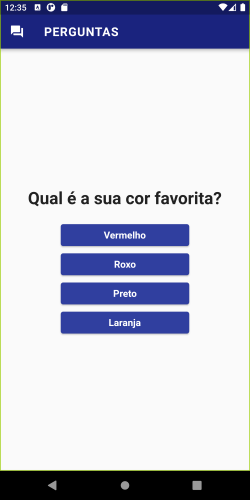
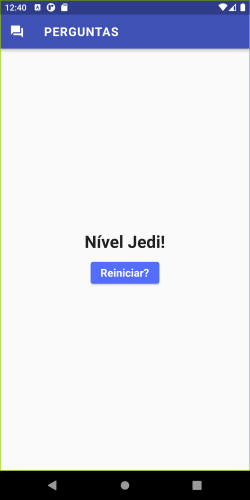

# Projeto Perguntas

Primeiro projeto apresentado no curso 'Aprenda Flutter e Desenvolva Apps Para Android e IOS 2022', disponível na Udemy. Neste projeto, foi ensinado noções básicas de Dart e Flutter.

Versão do Flutter: ^3.3.9

